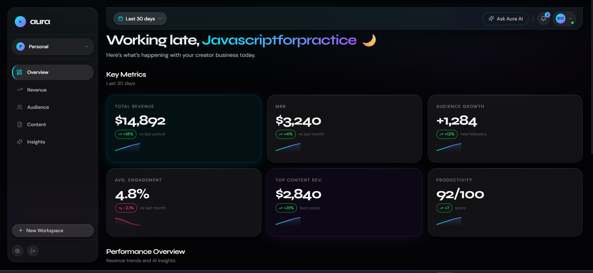

# Aura — Creator Analytics Dashboard

> Your entire creator business. One glass dashboard.

Aura brings revenue, audience, and content analytics into a single, beautiful, AI-powered place. Built for solo creators and solopreneurs who are tired of jumping between tabs.

---

## Screenshots

> __

---

## Features

- **Revenue Dashboard** — track Stripe, Gumroad, affiliate, and manual transactions in real time
- **Audience Analytics** — follower growth, platform breakdowns, engagement rates, and top-performing content
- **Content Performance** — see which posts drive the most revenue and followers
- **AI-Powered Insights** — weekly summaries and a conversational "Ask Aura AI" chat assistant powered by GPT-4o-mini
- **Workspace Management** — create and switch between multiple workspaces (Personal, Agency, Side Projects)
- **Global Date-Range Picker** — one filter controls all data across every page
- **Glassmorphic UI** — animated counters, spring-physics interactions, fully responsive
- **Authentication** — magic link and Google OAuth via Supabase Auth
- **Mobile Ready** — bottom navigation, floating quick-action button, and responsive layout

---

## Tech Stack

| Layer | Technology |
|---|---|
| Framework | Next.js 15 (App Router) |
| Styling | Tailwind CSS |
| State Management | Zustand |
| Data Fetching | TanStack Query (React Query) |
| Charts | Recharts |
| Animations | Framer Motion |
| Backend / Database | Supabase (PostgreSQL + Auth) |
| AI | OpenAI GPT-4o-mini |
| Payments | Stripe |
| Deployment | Vercel |

---

## Pages

### Landing Page
Public homepage with hero section, dashboard preview mockup, feature grid, social proof strip, and footer. Navigation links to Features, Pricing, and Blog.

### Login / Sign Up
Magic link or Google OAuth sign-in. New users are created automatically on first login. Successful auth redirects to the dashboard.

### Dashboard — Overview
Dynamic greeting based on the user's profile name. Six KPI cards (Total Revenue, MRR, Audience Growth, Avg. Engagement, Top Content Revenue, Productivity), a Revenue Trend chart, an AI Summary card, and an "At a Glance" quick stats strip. All data responds to the global date-range picker.

### Revenue
MRR and growth chips in the header, CSV export button, Daily Revenue bar chart, Revenue by Source donut chart, a searchable and sortable Transaction List, and an Add Transaction form. New transactions appear instantly in the list.

### Audience
Summary KPIs (Total Followers, New This Month, Avg. Engagement, Avg. Views/Post), an Audience Growth area chart with platform breakdown pills, individual Platform cards (YouTube, Twitter/X, Newsletter) with sparklines, and a Top Audience-Driving Content list.

### Content
KPI header, platform and sort filters, grid/list view toggle, content performance cards with sparklines, an "+ Add Content" modal, and a 12-week publishing cadence heatmap.

### Insights
Category filter tabs (All, Revenue, Content, Audience, Growth, General), AI-generated insight cards with priority levels and action chips, a Regenerate button, and graceful fallback data when the AI service is unavailable.

### Settings
Profile, Notifications, Security, and Appearance cards. Accessible via the sidebar gear icon.

### Ask Aura AI
Slide-over panel opened from the topbar or the mobile floating action button. Type any question and receive a GPT-4o-mini generated answer with loading and error states.

---

## Project Structure

```
aura/
├── app/
│   ├── (auth)/              # Authenticated routes
│   │   ├── dashboard/       # Overview page
│   │   ├── revenue/
│   │   ├── audience/
│   │   ├── content/
│   │   ├── insights/
│   │   └── settings/
│   ├── (marketing)/         # Public pages (landing, features, pricing, blog)
│   ├── api/
│   │   ├── ai-chat/         # Ask Aura AI endpoint
│   │   ├── ai-summary/      # Weekly summary endpoint
│   │   └── stripe/webhook/  # Stripe webhook handler
│   └── login/
├── components/
│   ├── ai/                  # AI chat panel
│   ├── audience/
│   ├── charts/
│   ├── content/
│   ├── dashboard/
│   ├── layout/              # Sidebar, topbar, mobile nav
│   ├── revenue/
│   └── ui/                  # GlassCard, GlassButton, GlassKPI, DataTable, etc.
├── hooks/                   # TanStack Query hooks
├── lib/                     # Supabase clients, Stripe config, utilities
├── stores/                  # Zustand stores
└── public/                  # Static assets
```

---

## Getting Started

### Prerequisites

- Node.js 18+
- A [Supabase](https://supabase.com) project
- An [OpenAI](https://platform.openai.com) API key
- A [Stripe](https://stripe.com) account (optional for payment features)

### Installation

```bash
# Clone the repository
git clone https://github.com/earlmorningstar/aura.git
cd aura

# Install dependencies
npm install
```

### Environment Variables

Create a `.env.local` file in the root of the project:

```env
# Supabase
NEXT_PUBLIC_SUPABASE_URL=your_supabase_project_url
NEXT_PUBLIC_SUPABASE_ANON_KEY=your_supabase_anon_key

# OpenAI
OPENAI_API_KEY=your_openai_api_key

# Stripe (optional)
STRIPE_SECRET_KEY=your_stripe_secret_key
STRIPE_WEBHOOK_SECRET=your_stripe_webhook_secret
```

### Supabase Setup

1. Create a new project at [supabase.com](https://supabase.com)
2. Run the SQL migrations from the `/supabase` folder (if provided) or set up tables manually
3. Enable the following auth providers in your Supabase dashboard:
   - Email (magic link)
   - Google OAuth
4. Add your site URL and redirect URLs to the Supabase auth settings

### Row-Level Security

For workspace creation to work fully, add RLS policies that allow users to insert and select their own workspaces based on `user_id`. Without this, a local fallback is used automatically.

```sql
-- Allow users to read their own workspaces
create policy "Users can view own workspaces"
  on workspaces for select
  using (auth.uid() = user_id);

-- Allow users to create their own workspaces
create policy "Users can insert own workspaces"
  on workspaces for insert
  with check (auth.uid() = user_id);
```

### Running Locally

```bash
npm run dev
```

Open [http://localhost:3000](http://localhost:3000) in your browser.

---

## Deployment

Aura is built to deploy on [Vercel](https://vercel.com) with zero configuration.

1. Push your repository to GitHub
2. Import the project into Vercel
3. Add all environment variables from `.env.local` to the Vercel project settings
4. Deploy

---

## Mobile Experience

On small screens the sidebar and topbar are replaced by:

- A **bottom navigation bar** with links to Overview, Revenue, Audience, Content, and Insights
- A **floating action button (FAB)** that opens a bottom sheet with the date-range picker, Ask Aura AI, workspace switcher, new workspace button, and Settings link

---

## Workspace Management

Users can create and switch between multiple workspaces (e.g., Personal, Agency, Side Projects) from the sidebar or the mobile quick-actions sheet. Workspace names must be between 2 and 50 characters. If Supabase RLS prevents the insert, a local fallback is used automatically and the workspace is still available for the session.

---

## Contributing

Pull requests are welcome. For major changes, please open an issue first to discuss what you would like to change.

---

## License

[MIT](LICENSE)

---

Made with ❤️ by Onyeabor Joel [Earl Morningstar]